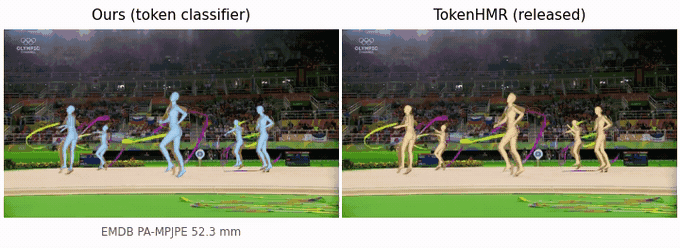

# Exploring Latent Representations for Human Mesh Recovery

Bachelor's thesis, ETH Zurich. Human mesh recovery estimates the 3D pose and shape of a
person from a single image. A recent line of work represents the pose *discretely*, as a
sequence of tokens drawn from a learned codebook, which turns pose estimation from
regression into classification.

This work studies the **pose tokenizer** as the interface between two stages that are
normally built apart: the tokenizer is selected by how faithfully it reconstructs a pose,
a criterion that never involves the image model that must later predict its codes. Eight
tokenizers are compared on two properties reconstruction error cannot express, and the
downstream model is retrained across the range from pose-space supervision to pure
classification.

Built on [TokenHMR](https://tokenhmr.is.tue.mpg.de).



Both panels come from one run of `thesis compare-video`. Person detection and tracking
run once and both models receive the identical boxes and frames, so the only difference
between them is the pose model. The error under the left panel is this model's EMDB
PA-MPJPE, read from the provenance manifest; no such number is shown for the released
model, since this work did not measure it under the same protocol.

---

## What the thesis finds

Reconstruction fidelity is a poor guide to how a tokenizer behaves downstream. Two
measures of the discrete code capture what it misses:

- **Label stability** `S(δ)` — the fraction of token indices that survive a small
  perturbation of the pose.
- **Codebook redundancy** `Δ_NN` — how far the decoded body moves when a code is replaced
  by its nearest neighbour.

Both are computed on the frozen tokenizer, so a tokenizer can be judged as a *prediction
target* before any image model is trained.

Running one identical classification setup across four tokenizers:

| Tokenizer | Recon. MPJPE | Stability `S(1°)` | Token top-1 | EMDB PA-MPJPE |
| --- | ---: | ---: | ---: | ---: |
| Transformer-FSQ-d4 | 2.58 mm | **63 %** | 24 % | **54.4 mm** |
| Transformer-VQ-L2-d256 | 2.45 mm | 53 % | **26 %** | 70.0 mm |
| CNN-VQ-L2-d256 | 2.27 mm | 24 % | 4 % | 72.8 mm |
| Transformer-VQ-Cosine-d4 | **1.51 mm** | 22 % | 5 % | 63.7 mm |

The ordering follows stability and inverts reconstruction: the best reconstructor of the
four is the second-worst classifier. Selecting by reconstruction error, the conventional
criterion, picks it.

Two further results:

- A model trained the way TokenHMR trains it **does not learn a discrete code**. Its
  predicted distribution stays diffuse, and decoding it as a token rather than as a
  softmax mixture costs more than 140 mm. Any method claiming to predict pose tokens
  should report its arg-max-decoded error.
- Token accuracy is a weak proxy for pose quality. Over 57,239 wrong predictions, 99 % move
  the body by less than 10 mm, so models a percentage point apart on top-1 differ by more
  than 40 mm of MPJPE.

The full write-up is in the thesis PDF.

## What is mine and what is upstream

The modified TokenHMR lives in a fork, pinned here as a submodule:

| Branch of [Marco-Weder/TokenHMR](https://github.com/Marco-Weder/TokenHMR) | Contents |
| --- | --- |
| `main` | pristine upstream TokenHMR, commit `ededd631` |
| `thesis` | the same code plus my changes (what this repository pins) |

So the complete set of changes made for this thesis is exactly:

```bash
git -C external/tokenhmr diff main..thesis
```

MoRo and VQ-HPS were read as references while implementing the Gumbel decode and the
classification setting, but no code from either is imported.

## Setup

### 1. Clone

```bash
git clone --recurse-submodules https://github.com/Marco-Weder/Exploring-Latent-Representations-for-Human-Mesh-Recovery.git
cd Exploring-Latent-Representations-for-Human-Mesh-Recovery/external/tokenhmr
```

If you cloned without `--recurse-submodules`: `git submodule update --init --recursive`.

### 2. Environment

Python 3.10, because SMPL depends on chumpy, which does not build on newer versions.

```bash
conda env create -f env/environment.yml
conda activate thesis-HMR

# chumpy and detectron2 build from source and need older build tools than they
# would otherwise pick up, which is what env/constraints.txt pins.
pip install -c env/constraints.txt "numpy<1.24" setuptools wheel
pip install -c env/constraints.txt --no-build-isolation chumpy==0.70

pip install -r env/requirements.txt
pip install -e .
```

Optional, and only for the demos: detectron2 for person detection, and Blender's `bpy`
for three of the figures. `env/system-requirements.md` covers those, plus CUDA, EGL and
the exact versions the reported numbers were produced with.

### 3. Check it worked

```bash
thesis doctor     # interpreter, packages, GPU, external tools, data, provenance
thesis paths      # every path the project resolves, and whether it exists
```

### 4. Data

The body models and checkpoints require registering at
<https://tokenhmr.is.tue.mpg.de> and accepting the licences.

```bash
bash fetch_demo_data.sh
thesis manifest link-tokenizers    # stable names for the stage-1 checkpoints
```

How much you need depends on what you want to do: about 6 GB for a demo, 34 GB to
re-render figures from cached results, and 825 GB to retrain or re-evaluate the image
model. `env/system-requirements.md` has the breakdown.

## Reproducing a result

Everything runs from any working directory. Three examples:

```bash
# A table cell: re-evaluate a finished run from its own saved config.
python tokenhmr/eval.py \
    --checkpoint logs/tokenhmr_chain2_st/runs/chain_st/checkpoints/last.ckpt \
    --model_config logs/tokenhmr_chain2_st/runs/chain_st/model_config.yaml \
    --dataset EMDB --decode_mode hard --exp_name my_check
# -> 52.28 mm EMDB PA-MPJPE, the value the thesis prints

# A figure.
thesis figure recon-frontier

# The video comparison at the top of this page.
thesis compare-video
```

`docs/REPRODUCE.md` maps every table and figure in the thesis to the command that
produces it. Appendix A.4 of the thesis carries the same map.

### Provenance

Which checkpoint produced which number is recorded in `manifest/`, built from evaluation
outputs already on disk:

```bash
thesis manifest check        # every published value against every measurement
thesis manifest tokenizers   # the eight stage-1 tokenizers
thesis golden check          # the deterministic analyses, value by value
```

Figure scripts read their numbers from the manifest and compare them against the values
printed in the thesis, so a regenerated figure either matches what was published or
reports the discrepancy. `docs/MANIFEST.md` explains the design.

## Layout

```
docs/                      reproduction guide, provenance notes, media
external/tokenhmr/         the fork; all code lives here
  repro/                   path resolution, provenance, the `thesis` command
  manifest/                run -> checkpoint -> number, version controlled
  env/                     environment and system requirements
  tools/                   training queues, data preparation
  tokenization/            stage 1: the pose tokenizer, and its analyses
  tokenhmr/                stage 2: the image model, training and evaluation
  thesis_figures/          figure scripts, split by whether they need a GPU
```

`external/tokenhmr/docs/LAYOUT.md` describes it in full.

## Training

```bash
# Stage 1: the pose tokenizer, on AMASS and MOYO.
python -m tokenization.train_poseVQ --cfg tokenization/configs/tokenizer_amass_moyo_fsq.yaml

# Stage 2: the image model. Experiment configs live in lib/configs_hydra/experiment/.
python -m tokenhmr.train experiment=tokenhmr_additive
```

The queues in `tools/queues/` run the multi-arm studies end to end, each arm followed by
evaluation in both decoding modes. They are resumable: an arm whose run directory already
holds a checkpoint is skipped.

## Acknowledgements

This work builds on [TokenHMR](https://tokenhmr.is.tue.mpg.de) and
[HMR2.0](https://shubham-goel.github.io/4dhumans/), and takes the classification idea from
[VQ-HPS](https://g-fiche.github.io/research-pages/vqhps/) and
[GenHMR](https://m-usamasaleem.github.io/publication/GenHMR/GenHMR.html). The finite scalar
quantizer is from [FSQ](https://arxiv.org/abs/2309.15505). SMPL, AMASS, MOYO, BEDLAM, 3DPW
and EMDB each carry their own licence, held by their respective owners.
