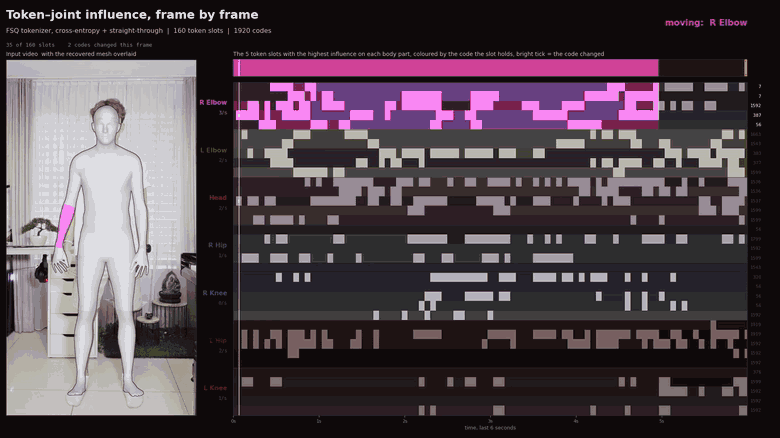
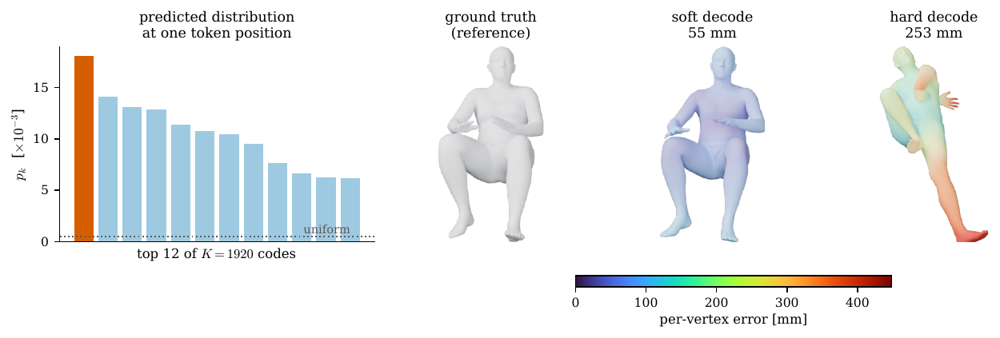
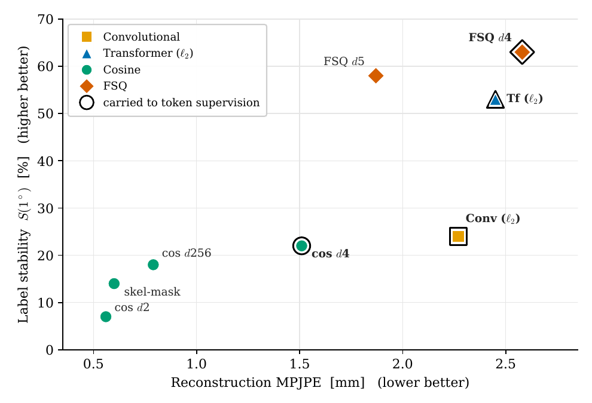

<div align="center">

# Exploring Latent Representations for Human Mesh Recovery

**On the Stability and Supervision of Discrete Pose Tokens**

Bachelor's thesis · ETH Zurich · Computer Vision and Learning Group

[](https://www.python.org/)
[](https://pytorch.org/)
[](https://tokenhmr.is.tue.mpg.de)
[](external/tokenhmr/LICENSE)

<br>



<sub>**Left:** the recovered SMPL mesh, in the studio grey of the thesis figures, overlaid on the
input video. **Right:** for each body part the person moves, the five token slots with the
highest influence on it, each coloured by the code the slot currently holds, and a bright tick
wherever that code changes. Only the part being moved keeps its colour; the rest are greyed out
but still ticking. Those five slots change code about **twice as often** when their part is the
one moving, which is the token–joint influence of Section 4.3 measured live, and the fact that
the greyed-out rows never fall silent is the label instability of Section 4.2 on the same
screen. One run of `thesis joint-video`.</sub>

</div>

---

> **The short version.** A pose tokenizer is chosen by how faithfully it reconstructs a pose.
> That criterion never involves the image model that has to predict its codes, and it turns out
> to order tokenizers *backwards*: the most faithful codebooks are the least predictable. What a
> discrete pose representation needs is not fidelity but **stable labels**.

Human mesh recovery estimates the 3D pose and shape of a person from a single image. A recent
line of work represents the pose *discretely*, as a sequence of tokens drawn from a learned
codebook, which turns pose estimation from regression into classification.

This work studies the **pose tokenizer** as the interface between two stages that are normally
built apart. Eight tokenizers are compared on two properties reconstruction error cannot
express, and the downstream image model is retrained across the range from pose-space
supervision to pure classification.

## What the thesis finds

### 1. A model trained the usual way never learns a discrete code



TokenHMR-style training supervises the tokens only through the decoded body, and a softmax
mixture over the whole codebook decodes accurately, so nothing ever requires the model to
commit to a code. It does not: no code dominates its prediction, the top one taking under 2 %
of the probability mass, and reading that prediction as an actual token instead of as a mixture
costs **more than 140 mm** of MPJPE. It is a token predictor in name only.

Any method claiming to predict pose tokens should report its arg-max-decoded error. It is
free to compute, and a model supervised only in pose space has no reason to keep it low.

### 2. Reconstruction fidelity is the wrong selection criterion

Two measures of the discrete code capture what reconstruction error misses, both computed on
the *frozen* tokenizer, so a tokenizer can be judged as a prediction target before any image
model is trained:

- **Label stability** `S(δ)` — the fraction of token indices that survive a small perturbation
  of the pose.
- **Codebook redundancy** `Δ_NN` — how far the decoded body moves when a code is replaced by
  its nearest neighbour.

<div align="center">

</div>

The learned codebooks sit on one frontier: every change that improves reconstruction makes the
labels more brittle. Finite scalar quantization is the one quantizer that leaves it, because a
fixed integer grid separates its codes by construction and they cannot drift into one another.

Running one identical classification setup across four of them:

| Tokenizer | Recon. MPJPE | Stability `S(1°)` | Token top-1 | EMDB PA-MPJPE |
| --- | ---: | ---: | ---: | ---: |
| Transformer-FSQ-d4 | 2.58 mm | **63 %** | 24 % | **54.4 mm** |
| Transformer-VQ-L2-d256 | 2.45 mm | 53 % | **26 %** | 70.0 mm |
| CNN-VQ-L2-d256 | 2.27 mm | 24 % | 4 % | 72.8 mm |
| Transformer-VQ-Cosine-d4 | **1.51 mm** | 22 % | 5 % | 63.7 mm |

The ordering follows stability and inverts reconstruction: the best reconstructor of the four
is the second-worst classifier, and the conventional criterion picks it.

### 3. Token accuracy barely measures pose quality

Over 57,239 wrong token predictions, 99 % move the body by less than 10 mm, because neighbouring
codes decode to nearly the same pose. Models a single percentage point apart on top-1 accuracy
differ by more than 40 mm of MPJPE.

<sub>Chapter 4 of the thesis reports all of this in full, with the supervision ablation, the
straight-through decode that restores the geometric gradient, and the negative results.</sub>

## Try it

<details>
<summary><b>See the receptive field of a single pose token</b> (tokenizer only, no image model)</summary>

<br>

```bash
python tools/tokenizer_roundtrip_check.py
```

Encodes a neutral pose into its 160 token indices, replaces one of them with a different code,
decodes both, and plots the joints that moved. The smallest thing in this repository that shows
what one pose token influences. Opens a matplotlib window.

</details>

<details>
<summary><b>Run the full pipeline on a video</b></summary>

<br>

```bash
# The animation at the top of this page.
thesis joint-video

# The whole codebook at once, lighting up as the motion goes past.
thesis title-video

# Two pose models on identical detections and frames.
thesis compare-video
```

Both cache detection and inference, so restyling the output never re-runs a network. Add
`--help` to either for the full set of options.

</details>

## Setup

<details>
<summary><b>1. Clone</b></summary>

<br>

```bash
git clone --recurse-submodules https://github.com/Marco-Weder/Exploring-Latent-Representations-for-Human-Mesh-Recovery.git
cd Exploring-Latent-Representations-for-Human-Mesh-Recovery/external/tokenhmr
```

If you cloned without `--recurse-submodules`: `git submodule update --init --recursive`.

</details>

<details>
<summary><b>2. Environment</b></summary>

<br>

Python 3.10, because SMPL depends on chumpy, which does not build on newer versions.

```bash
conda env create -f env/environment.yml
conda activate thesis-HMR

# chumpy and detectron2 build from source and need older build tools than they
# would otherwise pick up, which is what env/constraints.txt pins.
pip install -c env/constraints.txt "numpy<1.24" setuptools wheel
pip install -c env/constraints.txt --no-build-isolation chumpy==0.70

pip install -r env/requirements.txt
pip install -e .
```

Optional, and only for the demos: detectron2 for person detection, and Blender's `bpy` for
three of the figures. `env/system-requirements.md` covers those, plus CUDA, EGL and the exact
versions the reported numbers were produced with.

</details>

<details>
<summary><b>3. Check it worked</b></summary>

<br>

```bash
thesis doctor     # interpreter, packages, GPU, external tools, data, provenance
thesis paths      # every path the project resolves, and whether it exists
```

</details>

<details>
<summary><b>4. Data</b></summary>

<br>

The body models and checkpoints require registering at <https://tokenhmr.is.tue.mpg.de> and
accepting the licences.

```bash
bash fetch_demo_data.sh
thesis manifest link-tokenizers    # stable names for the stage-1 checkpoints
```

How much you need depends on what you want to do: about **6 GB** for a demo, **34 GB** to
re-render figures from cached results, and **825 GB** to retrain or re-evaluate the image model.
`env/system-requirements.md` has the breakdown.

</details>

## Reproducing a result

Everything runs from any working directory. Three examples:

```bash
# A table cell: re-evaluate a finished run from its own saved config.
python tokenhmr/eval.py \
    --checkpoint logs/tokenhmr_chain2_st/runs/chain_st/checkpoints/last.ckpt \
    --model_config logs/tokenhmr_chain2_st/runs/chain_st/model_config.yaml \
    --dataset EMDB --decode_mode hard --exp_name my_check
# -> 52.28 mm EMDB PA-MPJPE, the value the thesis prints

# A figure.
thesis figure recon-frontier

# A video.
thesis joint-video
```

`docs/REPRODUCE.md` maps every table and figure in the thesis to the command that produces it.
Appendix A.4 of the thesis carries the same map.

<details>
<summary><b>Provenance: which checkpoint produced which number</b></summary>

<br>

Recorded in `manifest/`, built from evaluation outputs already on disk:

```bash
thesis manifest check        # every published value against every measurement
thesis manifest tokenizers   # the eight stage-1 tokenizers
thesis golden check          # the deterministic analyses, value by value
```

Figure scripts read their numbers from the manifest and compare them against the values printed
in the thesis, so a regenerated figure either matches what was published or reports the
discrepancy. `docs/MANIFEST.md` explains the design.

</details>

<details>
<summary><b>Training both stages</b></summary>

<br>

```bash
# Stage 1: the pose tokenizer, on AMASS and MOYO.
python -m tokenization.train_poseVQ --cfg tokenization/configs/tokenizer_amass_moyo_fsq.yaml

# Stage 2: the image model. Experiment configs live in lib/configs_hydra/experiment/.
python -m tokenhmr.train experiment=tokenhmr_additive
```

The queues in `tools/queues/` run the multi-arm studies end to end, each arm followed by
evaluation in both decoding modes. They are resumable: an arm whose run directory already holds
a checkpoint is skipped.

</details>

## What is mine and what is upstream

The modified TokenHMR lives in a fork, pinned here as a submodule:

| Branch of [Marco-Weder/TokenHMR](https://github.com/Marco-Weder/TokenHMR) | Contents |
| --- | --- |
| `main` | pristine upstream TokenHMR, commit `ededd631` |
| `thesis` | the same code plus my changes (what this repository pins) |

So the complete set of changes made for this thesis is exactly:

```bash
git -C external/tokenhmr diff main..thesis
```

MoRo and VQ-HPS were read as references while implementing the Gumbel decode and the
classification setting, but no code from either is imported.

<details>
<summary><b>Repository layout</b></summary>

<br>

```
docs/                      reproduction guide, provenance notes, media
external/tokenhmr/         the fork; all code lives here
  repro/                   path resolution, provenance, the `thesis` command
  manifest/                run -> checkpoint -> number, version controlled
  env/                     environment and system requirements
  tools/                   training queues, data preparation
  tokenization/            stage 1: the pose tokenizer, and its analyses
  tokenhmr/                stage 2: the image model, training and evaluation
  thesis_figures/          figure scripts, split by whether they need a GPU
```

`external/tokenhmr/docs/LAYOUT.md` describes it in full.

</details>

<details>
<summary><b>This model against the released TokenHMR, on one clip</b></summary>

<br>


Both panels come from one run of `thesis compare-video`. Person detection and tracking run once
and both models receive the identical boxes and frames, so the only difference between them is
the pose model. The two are close, which is expected: this thesis is about how a discrete pose
representation should be built and supervised, not about beating TokenHMR's accuracy. The error
under the left panel is this model's EMDB PA-MPJPE, read from the provenance manifest; no such
number is shown for the released model, since this work did not measure it under the same
protocol.

</details>

## Acknowledgements

This work builds on [TokenHMR](https://tokenhmr.is.tue.mpg.de) and
[HMR2.0](https://shubham-goel.github.io/4dhumans/), and takes the classification idea from
[VQ-HPS](https://g-fiche.github.io/research-pages/vqhps/) and
[GenHMR](https://m-usamasaleem.github.io/publication/GenHMR/GenHMR.html). The finite scalar
quantizer is from [FSQ](https://arxiv.org/abs/2309.15505). SMPL, AMASS, MOYO, BEDLAM, 3DPW and
EMDB each carry their own licence, held by their respective owners.
